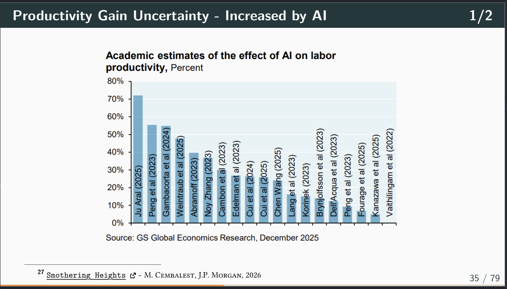
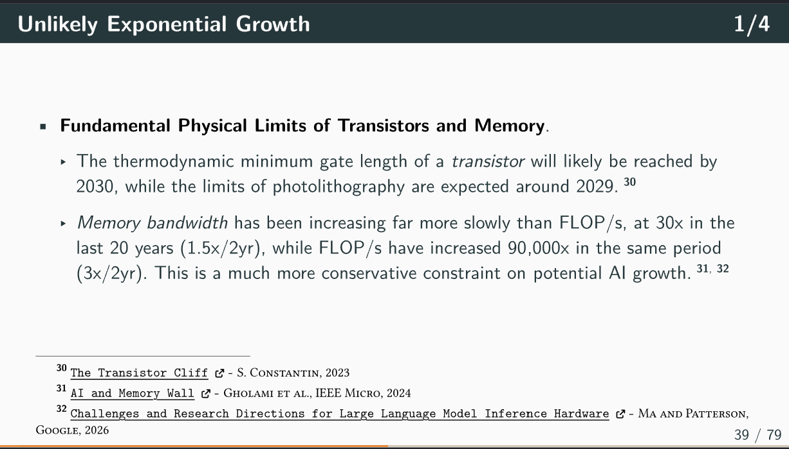
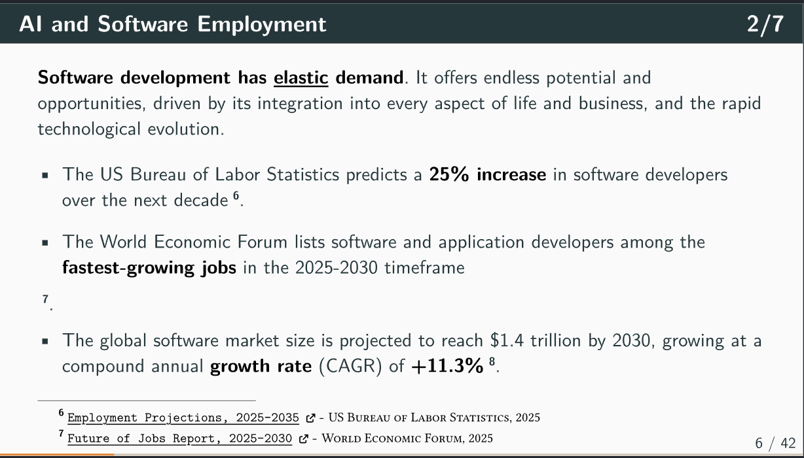
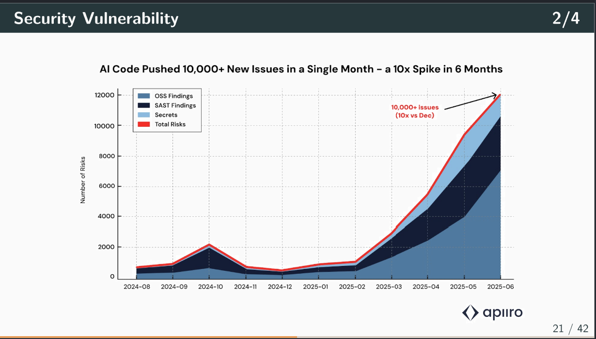

# (A More) Objective View of AI

The profound influence of AI on technology, human culture, and society is undeniable.
Opinions about AI range from predictions of imminent societal or economic collapse to, at the other extreme, excessive excitement and overreliance.

**These *open-source* notes aim to offer a more *balanced* and *objective* view of Artificial Intelligence (AI).**

> Every claim is backed by references from peer-reviewed research, industry reports, and recognized practitioners.

*Audience*: 

- People who want to understand AI's real capabilities and limitations through scientific evidence (like me).
- People curious about what AI actually is (and isn't) from a cognitive and computational perspective.
- Software engineers (often overexcited) who want to use AI as a tool, not a replacement.

*If you enjoy these notes or you find them useful*, please add a **Star**. (This will help others discover them)

 

\* These notes are a living document and will be updated with new research findings and community contributions.

## Table of Contents

### 1. [(A More) Objective View of AI](01.notes_on_AI.pdf)

A broad examination of AI from scientific, cognitive, and societal perspectives.

- **Introduction**
- **AI and Human Brain are Structurally Different**
- **AI and Human Brain are Functionally Different**
- **The Illusion of Consciousness**
- **Productivity Gain Uncertainty**
- **Unlikely Exponential Growth**
- **AI Technical Limitations**
 
  - Hallucinations are Mathematically Inevitable
  - Generalization
  - Creativity
  - Production Quality
  - Causality and Real-World Understanding
  - Non-Determinism
  - Quality Degradation 

- **AI "Social" Limitations**
  
  - Intellectual Property
  - Sycophancy
  - Social Coherence
  - Security Risks
  - Liability

- **Implications for the Future**
 
  - Employment
  - Deskilling
  - Echo Chamber
  - Social Risks

### 2. [Software Development in the Age of AI](02.notes_on_AI.pdf)

A practical look at AI in software development.

- **AI and Software Employment**
- **Limitations of AI-Generated Code**

  - Generalization
  - Creativity
  - The Illusion of Competence
  - Technical Debt
  - Security Vulnerability
  - Redundancy
  - The 'Last Mile' Problem

- **AI as a Software Engineering Tool**

  - Code Generation is NOT Software Engineering
  - The Role of Human Expertise

- **Engineering Practices in the Age of AI**

## Format

The notes are written in [Typst](https://typst.app/), a modern markup language, alternative to LaTeX, for creating  documents. They are compiled to PDF and HTML.

## Contributing

Please see the [CONTRIBUTING.md](CONTRIBUTING.md) file for more information.

## Further References

- [All about AI](https://www.youtube.com/playlist?list=PL2sqoYCw1CJXpmI3AvOXz2r4iEqRFEpkS) by Andrew Perfors.
- [Modern-Day Oracle or Bullshit Machines](https://thebullshitmachines.com/) by Carl T. Bergstrom and Jevin D. West.

## License

This repository is dual-licensed:

* **Course Content:** All written materials, slides, and images are licensed under [Creative Commons Attribution 4.0 International (CC BY-SA 4.0)](LICENSE-CC-BY-SA.md).
* **Source Code:** All code examples and scripts are licensed under the [MIT License](LICENSE-MIT.md).

## Author

`Federico Busato`, [federico-busato.github.io](https://federico-busato.github.io/)

- &#127760; LinkedIn: [www.linkedin.com/in/federico-busato/](https://www.linkedin.com/in/federico-busato/)
- &#129419; Bluesky: [fbusato.bsky.social](https://bsky.app/profile/fbusato.bsky.social)
